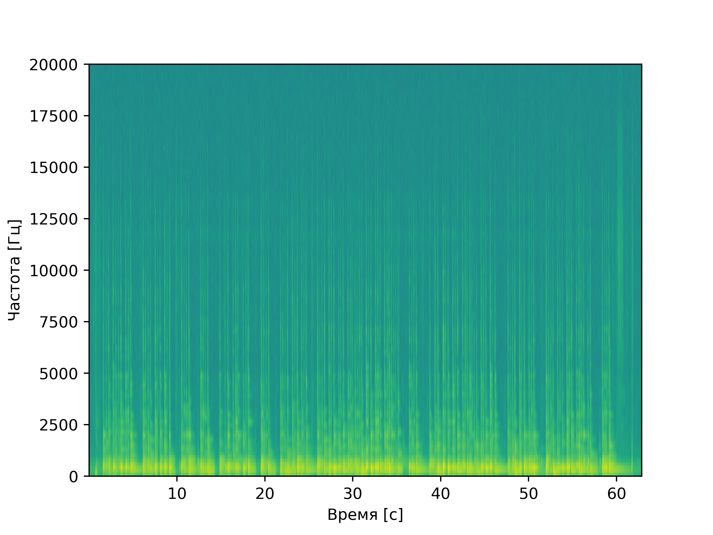
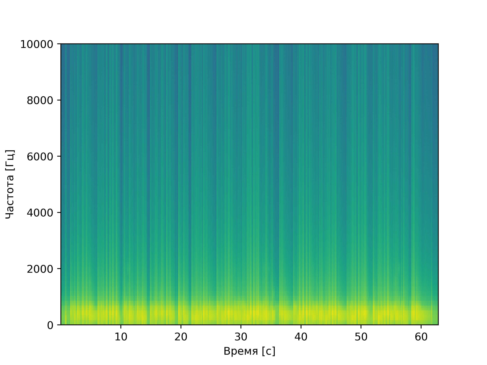
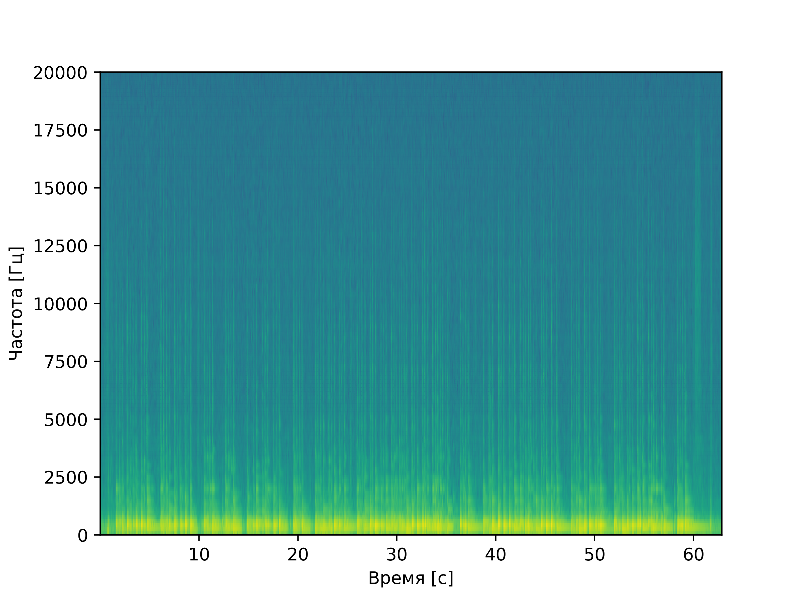
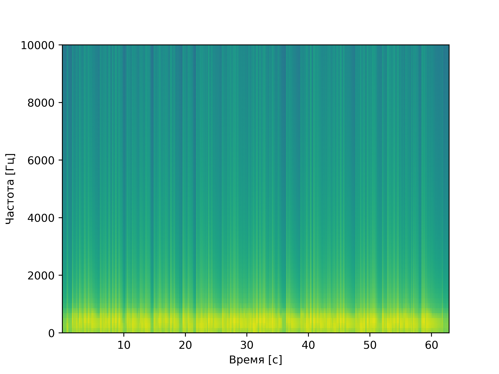
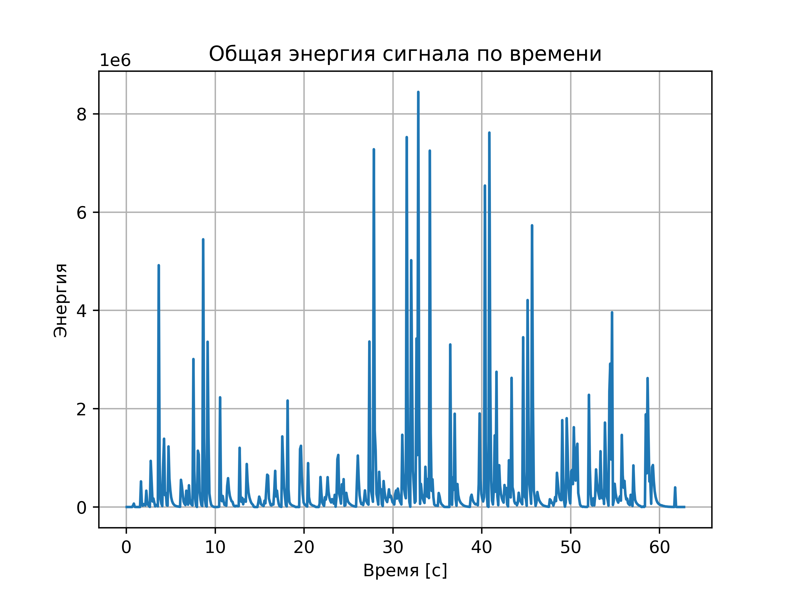

# OAVI_lab9
_Анализ шума в аудиосигналах_

Была поставлена следующая задача:

### Анализ шума музыкального инструмента
1. Записать звук музыкального инструмента (формат WAV)
2. Построить спектрограмму с оконным преобразованием Фурье (окно Ханна)
3. Оценить уровень шума и применить фильтрацию (Савицкого-Голея и Винеровский фильтр)
4. Найти моменты времени с наибольшей энергией в заданных частотных диапазонах

***

## Функции

Функции для данной задачи находятся в файле `noise.py`.

-   `find_high_energy_windows(samples, sample_rate, window_duration=0.1)`
    > Находит временные окна с максимальной энергией сигнала.
    >
    > _ПАРАМЕТРЫ:_
    >    *   **samples** - Аудиоданные (массив numpy)
    >    *   **sample_rate** - Частота дискретизации
    >    *   **window_duration** - Длительность анализируемого окна (по умолчанию 0.1 сек)
    >
    > _ВОЗВРАЩАЕТ:_
    >    *   Кортеж (max_time, times, energy_total) - время максимума, массив времен, массив энергий

-   `spectrogram_plot(samples, sample_rate, t=10000)`
    > Строит спектрограмму сигнала.
    >
    > _ПАРАМЕТРЫ:_
    >    *   **samples** - Аудиоданные
    >    *   **sample_rate** - Частота дискретизации
    >    *   **t** - Верхняя граница частот для отображения

-   `denoise(samples, sample_rate, cutoff_freuency, passes=1)`
    > Применяет комбинированную фильтрацию (Савицкого-Голея + БИХ-фильтр).
    >
    > _ПАРАМЕТРЫ:_
    >    *   **samples** - Аудиоданные
    >    *   **sample_rate** - Частота дискретизации
    >    *   **cutoff_freuency** - Граничная частота фильтра
    >    *   **passes** - Количество проходов фильтра
    >
    > _ВОЗВРАЩАЕТ:_
    >    *   Отфильтрованный сигнал

-   `to_pcm(y)`
    > Конвертирует нормализованный сигнал в PCM-формат.
    >
    > _ПАРАМЕТРЫ:_
    >    *   **y** - Нормализованный сигнал (диапазон [-1, 1])
    >
    > _ВОЗВРАЩАЕТ:_
    >    *   Сигнал в 16-битном PCM формате

---

# Работа программы

## Исходный сигнал

### Оригинальная спектрограмма:

_Полный частотный диапазон до 20 кГц_

## Фильтрация шума

### После однократной фильтрации:

<table>
  <tr>
    <td></td>
    <td></td>
  </tr>
  <tr>
    <td>Комбинированная фильтрация</td>
    <td>Только фильтр Савицкого-Голея</td>
  </tr>
</table>

### После двукратной фильтрации:

## Анализ энергии сигнала

### Распределение энергии по времени:

_Пики отмечены вертикальными линиями_

## Сравнение аудиофайлов
- [Исходный файл](audio/music.wav)
- [После однократной фильтрации](audio/denoised_once.wav)
- [После двукратной фильтрации](audio/denoised_twice.wav)

***

### Технические детали
- Частота дискретизации: 44.1 кГц
- Использованное окно для Фурье-анализа: Ханна
- Параметры фильтрации:
  - Пороговая частота: 1000 Гц
  - Порядок фильтра: 3
  - Длина окна Савицкого-Голея: 100 отсчетов